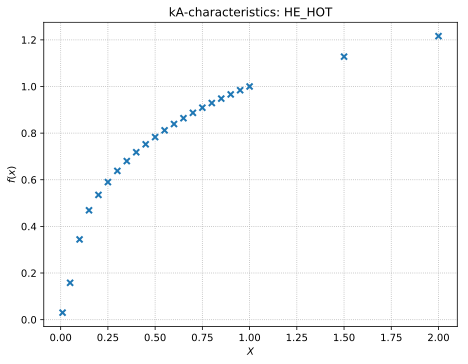
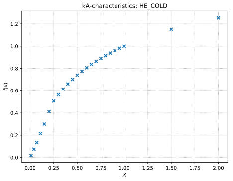

tespy.data module
=================

Default characteristics
-----------------------

TESTING

   

Module contents
---------------

.. automodule:: tespy.data
    :members:
    :undoc-members:
    :show-inheritance:
