tespy.data module
=================

Default characteristics
-----------------------

Characteristic lines
^^^^^^^^^^^^^^^^^^^^
**turbine**

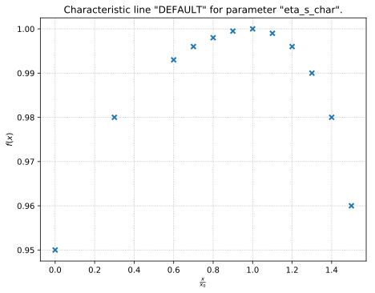

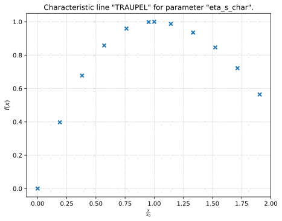

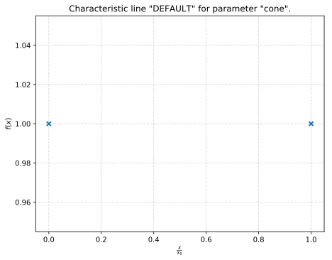

**compressor**

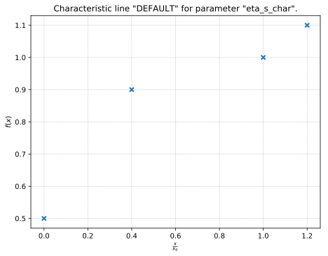

**pump**

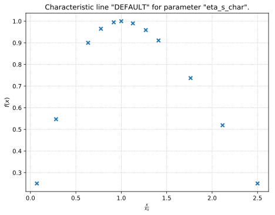

**combustion engine**

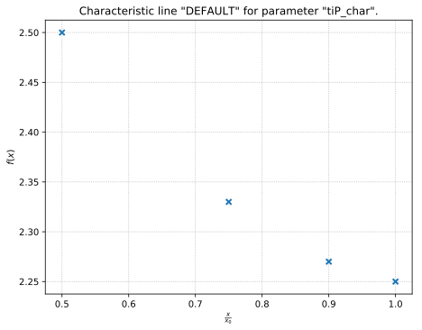

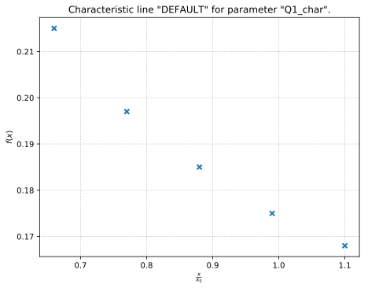

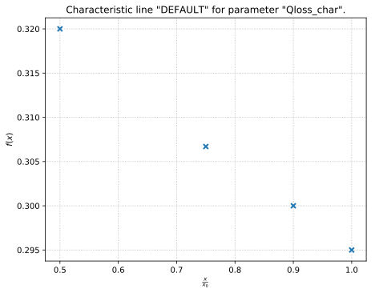

**heat exchanger**

.. figure:: _images/heat exchanger_kA_char1_DEFAULT.svg
    :scale: 100 %
    :alt: Characteristic line "DEFAULT" for parameter "kA_char1".
    :align: center

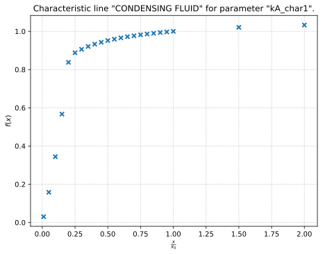

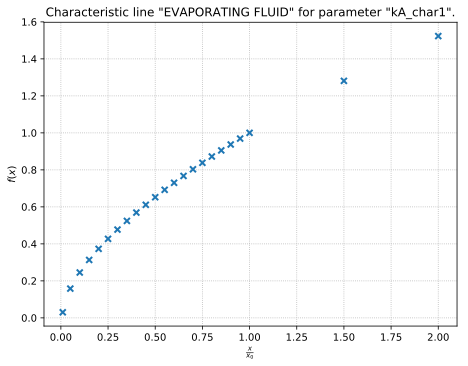

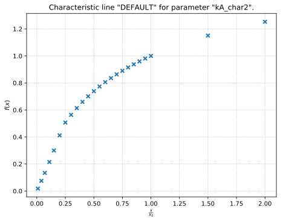

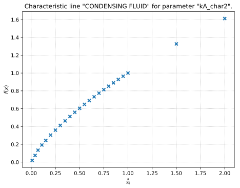

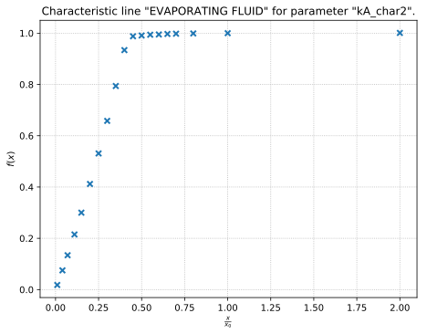

**condenser**

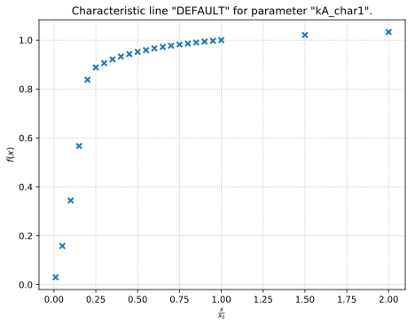

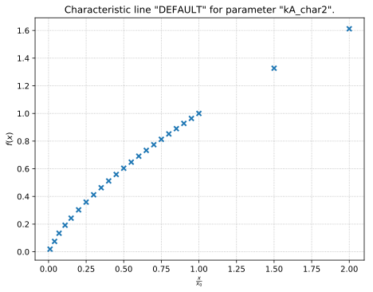

**desuperheater**

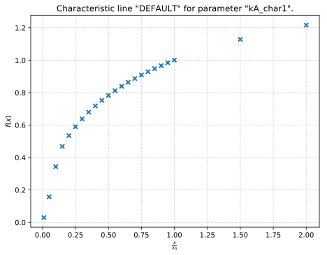

**heat exchanger simple**

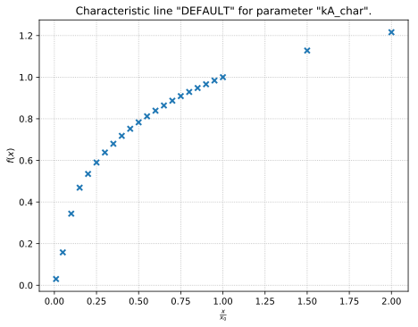

**pipe**

**water electrolyzer**

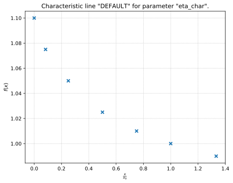

Characteristic maps
^^^^^^^^^^^^^^^^^^^

Module contents
---------------

.. automodule:: tespy.data
    :members:
    :undoc-members:
    :show-inheritance:
