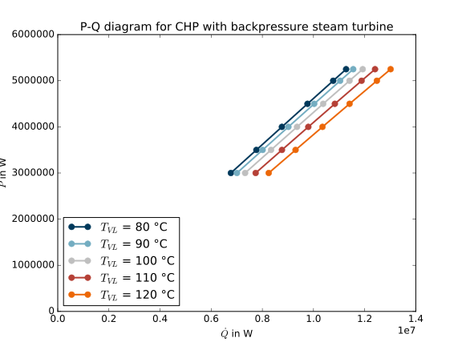

.. _using_tespy_label:

###########
Using TESPy
###########
	
TESPy provides a simulation package for component based thermal engineering containing the most important
basic components of such plants. In the introduction you will learn the basics of modelling component based
plants in TESPy.

We give an overview on the available components, introduce you to creating you own components and component
groups and give a short introduction on how TESPys solver works and how to handle different calculations modes.
Information on handling of fluid properties can be found at the end of this page.

We highly recommend to check our :ref:`step by step tutorial <heat_pump_tutorial_label>` on how to
set up a heat pump in TESPy. You will learn, how to set up and design a plant as well as calculate offdesign/partload performance.
Additionally we provide basic examples in the :ref:`examples section <tespy_examples_label>`.

.. figure:: api/_images/tutorial_heat_pump.svg
    :align: center
	
    Figure 1: Topology of a heat pump.
	
.. _using_tespy_introduction_label:

Introduction
============

Set up a plant
--------------

In order to simulate a plant you will have to create a tespy.network. The network is the main container for the model.

You need to specify a list of the fluids you need for the calculation in your plant. For more information on the fluid properties jump to the :ref:`bottom of this page <tespy_fluid_properties_label>`.

.. code-block:: python

    from tespy import nwk
	# create a network object with air and water as fluids
	fluid_list = ['air', 'water']
    my_plant = nwk.network(fluids=fluid_list)

On top of that, it is possible to specify a unit system and value ranges for the networks variables. If you do not specify these, TESPy will use SI-units.

.. code-block:: python

    from tespy import nwk
	
	# set the unitsystem for temperatures to °C and for pressure to bar
	my_plant.set_attr(T_unit='C', p_unit='bar', h_unit='kJ / kg')
	my_plant.set_attr(T_range=[10, 700], p_unit=[0.05, 150], h_unit=[15, 4000])

Now you can start to create the components of the network.

Set up components
-----------------

Available components can be found :ref:`here <tespy_components_label>`. If you set up a component you have to specify a (within one network) unique label. Moreover, it is possible to specify parameters for the component, for example power P for a turbine or upper terminal temperature difference ttd_u of a heat exchanger. The full list of parameters for a specific component (e. g. a vessel) is stated in the classes documentation.

Parameters for components are generally optional. Only the components label and in case you want to use a combustion chamber, the combustion chambers fuel, are mandatory parameters to provide. If an optional parameter is not specified by the user, it will be a result of the plants simulation. In this way, the set of equations a component returns is determined by which parameters you specify. You can find all equations in the :ref:`components documentation <tespy_components_label>` as well. The example below shows how to create a component with specific parameters, set or reset and how to unset a parameter:

.. code-block:: python

	from tespy import cmp
	my_pump = cmp.pump(label='hp pump', P=1e3) # create pump labeled 'hp pump'
	my_pump.set_attr(P=2e3, eta_s=0.9) # set the power to 2000 W, set isentropic efficiency to 90 %
	my_pump.set_attr(P=math.nan) # unset power
	
After setting up the components the next step is to connect the components in your network.

Establish connections
---------------------

Connections are used to link two components (outlet of component 1 to inlet of component 2, source to target). If two components are connected to each other the fluid properties at the source will be equal to the properties at the target. It is possible to set the properties on each connection in a similar way as parameters are set for components. You may specify:

 * mass flow*,
 * pressure*,
 * enthalpy*,
 * temperature*,
 * vapour mass fraction for pure fluids,
 * a fluid vector and
 * a balance closer for the fluid vector.

All parameters but the fluid vector have to be numeric values. The fluid vector has to be specified as dictonary, see the example below. The parameter :code:`fluid_balance` can only be :code:`True` or :code:`False`. For the properties marked with * it is possible to use references instead of numeric values. This can be used for example if you want to have the pressure in two parts of your network related in a specific way but you do not know the values prior to the plant simulation.

.. code-block:: python
	
	from tespy import con
	ws_cond = con.connection(waste_steam_source, 'out1', condenser, 'in1', x=0.97) # waste steam source to condenser hot side inlet and setting vapour mass fraction
	cond_cp = con.connection(condenser, 'out1', condensate_pump, 'in1', fluid={'water': 1, 'air': 0}) # setting a fluid vector: {'fluid i': mass fraction i}
	cp_fwt = con.connection(condensate_pump, 'out1', feed_water_tank, 'in1')
	fwt_fwp = con.connection(feed_water_tank, 'out1', feed_water_pump, 'in1') # connection without parameter specification
	fwp_eco = con.connection(feed_water_pump, 'out1', economiser, 'in2', p=150) #  setting pressure
	eco_drum = con.connection(economiser, 'out2', drum, 'in1', T=320, p=con.ref(d, 0.98, 0)) # setting temperature and pressure via reference object
	eva_eco = con.connection(evaporator, 'out1', economiser, 'in1', T=350, m=100) # setting temperature and mass flow
	eco_fgs = con.connection(economiser, 'out1', flue_gas_sink, 'in1', fluid_balance=True, fluid={'air': 1}, p=1) # setting fluid vector partially as well as the fluid balance parameter and pressure

.. figure:: api/_images/intro_connections.svg
    :align: center
	
    Figure 2: Topology after defining the above connections.

If you want to set, reset or unset a connection parameter the same logic as for the components is applied.

.. code-block:: python

	ws_cond.set_attr(x=0.95, p=0.05) # reset vapour mass fraction, set pressure
	fwp_eco.set_attr(p=math.nan) # unset pressure
	
On top of these specifications it is possible to specify the parameters data container manually. You need to import the :code:`hlp` module. The data container class for fluid properties (mass flow, pressure, enthalpy, temperature and vapour mass fraction) is called dc_prop.

.. code-block:: python

	from tespy import hlp
	
	# set the pressure to 0.7 MPa, and set this parameter for the calculation
	ws_cond.set_attr(p=dc_prop(val=0.07, val_set=True, unit='MPa'))
	
	# set the pressure to 0.7 MPa, set this parameter for the calculation and add a reference
	ws_cond.set_attr(p=dc_prop(val=0.07, val_set=True, unit='MPa', ref=con.ref(fwp_eco, 0.01, 0), ref_set=True))
	
If you want to specify the fluid vector you can do it in the following way:

.. code-block:: python

	ws_cond.set_attr(fluid=dc_flu(val={'water': 1, 'air': 0}, val_set:{'water': False, 'air': True}))
	
Busses: power connections
-------------------------

Busses can be used to add up the power of different turbomachinery or to add up heat flux of different heat exchangers within your network. The handling is very similar to connections and components. You need to add components to your busses as a list containing the component object and a factor, the power of the component will be multiplied with. Do not forget to add the busses to you network.

This can be used for easy post processing, e. g. to calculate thermal efficiency or you can build up relations between components in your network. If you want to use the busses for postprocessing only, you do not specify the sum of the power or heat flux on your bus. If you set a value for P (equal parameter for heat flux or power), an additional equation will be added to your network. This could be useful, e. g. for establishing relations between different components, for instance when using a steam turbine powered feed water pump. In the code example the power of the turbine and the feed water pump is added up and set to zero, as the turbines and feed water pumps power have to be equal in absolute value but have different sign. The sign can be manipulated, e. g. in order to design two turbines with equal power output.

.. code-block:: python
	
	from tespy import nwk, con
	
	...
	
	fwp_bus = con.bus('feed water pump', P=0) # set a value for the total power on this bus.
	fwp_bus.add_comps([turbine_fwp, 1], [fwp, 1])
	
	turbine_bus = con.bus('turbines', P=0) # set a value for the total power on this bus
	turbine_bus.add_comps([turbine_hp, 1], [turbine_lp, -1])
	# the values for the busses power can be altered by using .set_attr()
	
	power = con.bus('power output') # bus for postprocessing, no power (or heat flux) specified
	power.add_comps([turbine_hp, 1], [turbine_lp, 1])
	
	my_network.add_busses(fwp_bus, turbine_bus, power)
	
Two labels for busses have a predefined function in the postprocessing analysis: 'P_res' and 'Q_diss'. If you specify these labels for your busses, 'P_res' will be interpreted as the total power of your process and 'Q_diss' as total amount of dissipated heat flux (from the process, not internally). Given these key figures, thermal efficiency or COP will be calculated and an entropy analysis for your systems components will be performed.*

*Planned feature, not implemented yet!

Subsystems/Component groups
---------------------------

Subsystems are an easy way to add frequently used component groups such as a drum with evaporator or a preheater with desuperheater to your system. You can use the predefined subsystems or :ref:`create a subsytem yourself <tespy_subsystems_label>`. Every subsystem must have two interfaces, an inlet interface and an outlet interface. These interfaces have a variable number of connections, which can be connected with the rest of your network. The example below uses the predefined subsystem preheater with desuperheater (:code:`ph_desup_cond()`). The subsystems interfaces are subsystem.inlet and subsystem.outlet, both with two connections. All connections (and components) of the subsystem have to be added to the network in order to start a simulation. This can easily be done by adding the whole subsystem object to your network.

.. code-block:: python

	from tespy import subsys, cmp
	ext = cmp.source(label='extraction steam')
	cond = cmp.sink(label='condensate')
	fwc = cmp.source(label='feed water cold')
	fww = cmp.sink(label='feed water warm')

	# a preheater with desuperheater part
	preheater = subsys.ph_desup(label='sub1')

	# connections into the subsystem are attached to subsystem.inlet, connections out of the subsystem to subsystem.outlet
	ext_pre = connection(ext, 'out1', subsystem.inlet, 'in1')
	pre_cond = connection(subsystem.outlet, 'out1', cond, 'in1')
	fwc_pre = connection(fwc, 'out1',subsystem.inlet,'in2')
	pre_fwc = connection(subsystem.outlet, 'out2', fww, 'in1')
	
	# parametrisation
	preheater.set_attr(ttd=8, pr1_desup=1, pr2_desup=1, pr1_cond=1, pr2_cond=1)
	
	ext_pre.set_attr(m=5, p=4, h=29e5, fluid={'water': 1})
	fwc_pre.set_attr(p=50, h=3e5, fluid={'water': 1})
	pre_fwc.set_attr(p0=50)

	# create the network and connections and subsystems
	my_plant.add_conns(ext_pre, pre_cond, fwc_pre, pre_fwc)
	my_plant.add_subsys(subsys)
	

.. figure:: api/_images/intro_subsys.svg
    :align: center
	
    Figure 3: Topology of the subsystem.
	

Start your calculation
----------------------

At the bottom of your script add the following line and off you go! Additional/advanced information on the solving process and which options are available are found :ref:`here <tespy_solving_network_label>`.

.. code-block:: python

	my_plant.solve(mode='design')
	
How can TESPy contribute to your energy system calculations?
------------------------------------------------------------

In this part you learn how you can use TESPy for your energy system calculations: In energy system calculations, for instance in oemof-solph, plants are usually modelled as abstract components on a much lower level of detail. In order to represent a plant within an abstract component it is possible to supply characteristics establishing a connection between your energy system model and a specific plant model. Thus the characteristics are a representation of a specific plant layout in terms of topology and process parameters.

The following part will show how to generate characteristics for a CHP unit. There are various technologies and concepts, for this example we will generate characteristics for a simple CHP with a backpressure steam turbine and a regenerative reheating unit as shown in the figure below. We want the characteristics to provide a correlation between output power and output heat flux at different temperatures of flow into a district heating system.

.. figure:: api/_images/CHP.svg
    :align: center
	
    Figure 4: Topology of the power plant.

Important design information can be obtained from the table below, the locations are indicated in the figure. After designing the plant, the total power output defined by the power_bus has been changed stepwise from a slight overload of 5.25 MW to lower part loads 3.00 MW with a stepwidth of 0.50 MW (0.25 MW for first step). Further the required temperature for the heating system was changed from 80 °C to 120 °C in steps of 10 K.

=========== =============== ======= ========
 location    parameter       value   unit
=========== =============== ======= ========
 fs          | pressure      | 100   | bar
             | temperature   | 550   | °C
----------- --------------- ------- --------
 extr        pressure        10      bar
----------- --------------- ------- --------
 power_bus                   5e6     W
----------- --------------- ------- --------
 condenser   ttd_u :sup:`2`  12      K
----------- --------------- ------- --------
 reheater    ttd_u :sup:`2`  7       K
----------- --------------- ------- --------
 from_hs     | pressure      | 10    | bar
             | temperature   | 60    | °C
----------- --------------- ------- --------
 to_hs       temperature     110     °C
=========== =============== ======= ========

2: ttd_u is the upper terminal temperature difference, defined as temperature difference between hot side inlet and cold side outlet.

As a result we get the PQ-diagram of this power plant containing the characteristics at different temperatures in the heating system. Within your oemof-solph energy system it is now possible to implement the characteristic lines as a function of the temperature level in the heating system.

	
    Figure 5: PQ-diagram for a CHP unit.
	
Download the :download:`source file <../examples/chp.py>` of this example.
	
.. _tespy_solving_network_label:
	
Solving a TESPy Network
=======================

Before learning how solve your TESPy network a short introduction on how the solution process works is provdided below.

Algorithm
---------

A TESPy Network can be represented as a linear system of non-linear equations, consequently the solution is obtained with numerical methods. TESPy uses the n-dimensional newton algorithm to find the systems solution, which may only be found, if the network is parameterized correctly. The variables of the system are mass flow, pressure, enthalpy and the fluid components on each connection of the network. Thus, the number of fluids you specify in the fluid list for the network and the number of connections determine the number of variables in the system:

.. math:: num_{var} = num_{conn} \cdot (3 + num_{fluids}).

The newton algorithm requires the calculation of residual values for the equations and partial derivatives of all variables (jacobian matrix). In the next step the matrix has to be inverted and multiplied with the residual vector to calculate the increment for the systems variables. This process is repeated until every equations result in the system is correct, thus the residual values are smaller than a specified error tolerance.

jacobian matrix J

.. math::
	J(\vec{x})=\left(\begin{array}{cccc}
	\frac{\partial f_1}{\partial x_1} & \frac{\partial f_1}{\partial x_2} & \cdots & \frac{\partial f_1}{\partial x_n} \\ 
	\frac{\partial f_2}{\partial x_1} & \frac{\partial f_2}{\partial x_2} & \cdots & \frac{\partial f_2}{\partial x_n} \\ 
	\vdots & \vdots & \ddots & \vdots \\
	\frac{\partial f_n}{\partial x_1} & \frac{\partial f_n}{\partial x_2} & \cdots & \frac{\partial f_n}{\partial x_n}
	\end{array}\right)
	
calculate increment

.. math::
	\vec{x}_{i+1}=\vec{x}_i-J(\vec{x}_i)^{-1}\cdot f(\vec{x}_i)
	
stop when

.. math::
	||f(\vec{x}_i)|| \leq \epsilon

This means that you have to provide the exact amount of required parameters (neither less nor more) and the parametrisation must not lead to linear dependencies. Each parameter you set for a connection or each power respectively heat flux you set for a bus will add one equation. On top, each component provides a different amount of basic equations plus the equations provided by your component specification. For example, setting the power of a pump results in an additional equation compared to a pump without specified power:

.. math::
	\forall i \in \mathrm{network.fluids} \, &0 = fluid_{i,in} - fluid_{i,out}\\
											 &0 = \dot{m}_{in} - \dot{m}_{out}\\
					 \mathrm{additional:} \, &0 = 1000 - \dot{m}_{in} (\cdot {h_{out} - h_{in}})

.. _using_tespy_solver_handling_label:

Handling					 
--------

After you added all of your connections, subsystems and busses to your network, you can start the calculation with the following command.

.. code-block:: python

	nw.solve(init_file=None, design_file=None, mode='design',
			 dec='.', max_iter=50, parallel=False)
	
This starts the initialisation of your network and proceeds to its calculation.

* :code:`nw` is the network object,
* :code:`init_file` is the .csv-file you want to use for initialisation,
* :code:`design_file` is the .csv-file which holds the information of your plants design point,
* :code:`mode` is the calculation mode (design-calculation or offdesign-calculation),
* :code:`dec` is the decimal separator in the .csv-files,
* :code:`max_iter` is the maximum amount of iterations performed by the solver and finally
* :code:`parallel` parallel computation of components (True/False).

There are two modes available (:code:`'design'` and :code:`'offdesign'`). If you choose :code:`offdesign` as calculation mode a design file must be specified. The initialisation file is always optional but very valuable, if you specify it to be :code:`None`, the initialisation from .csv-file will be skipped. Parallel computation for the components might slow down the computation for smaller networks.

Initialisation
^^^^^^^^^^^^^^

The newton algorithm requires starting values for all variables of the system. A high quality of initial values (low deveiation from solution) improves convergence speed and stability, whereas bad starting values might lead to instabilty and diverging calculation can be the result. In order to provide good initial values you can choose between three different initialisation options:

* initialise with standard values,
* provide starting values on your connections (see connection d in the subsystem example, usage: :code:`m0, p0, h0`) and
* provide a .csv-file of a previously calculated network.

The last option usually yields the best performance and is highly receommended. In order to initialise your calculation from a .csv-file, you need to provide the filename (e. g. myfile_conn.csv). The file does not need to contain all connections of your network, thus you can build up your network bit by bit and initialise the existing parts of your network from the .csv-file. Be aware that a change within the fluid vector does not allow this practice. Thus, if you plan to use additional fluids in parts of the network you have not touched until now, you will need to state all fluids from the beginning.

Postprocessing
^^^^^^^^^^^^^^

The postprocessing has three functions you can apply to your calculation:

* plot the convergence history (:code:`nw.plot_convergence()`),
* print the results to prompt (:code:`nw.print_results()`) and
* save the results in a .csv-file (:code:`nw.save(filename, dec='.')`).

The main purpose of the plotting function is trouble shooting when your calculation does not converge. Therefore you specify a maximum number of iterations for the solver (:code:`max_iter`). As a result you get a plot of mass flow, pressure and enthalpy on all connections of your network. From there it might be possible to identify e. g. oscillating values or values that stay beyond the specified bounds of the fluid properties.

You can print the components and its properties to the prompt or, if you choose to save your results in a .csv-file, open the file and look up the components results in the file 'filename_comp.csv'. The mass flows and fluid properties of all connections are stored in the file 'filename_conn.csv'. On top, you can specify the decimal separator with :code:`nw.save(filename, dec='.')`.

Offdesign calculation
^^^^^^^^^^^^^^^^^^^^^
	
After designing your process you might want to gain information on offdesign behaviour. By stating :code:`'offdesing'` as calculation mode, you can auto-switch the components and connections to offdesign mode. This means, that all parameters given in :code:`component.design` will be unset and instead all parameters provided in :code:`component.offdesign` will be set. The same action is performed for the connections.

The default design and offdesign parameters for components can be found in the components documentation. For connections, there are no default design and offdesign parameters. For example, in order to specify custom design and offdesign parameters for a turbine use

.. code-block:: python

	turbine.set_attr(design=['P', 'eta_s'], offdesign=['cone', 'char'])
	
and for connections it works in the same way.

.. code-block:: python

	connection.set_attr(design=['h'], offdesign=['T'])
	
The table below contains frequently used offdesign parameters of the components.

=======================	======================	===================================================
 component             	 parameter            	 affects
=======================	======================	===================================================
 vessel                	 zeta                  	 pressure drop
-----------------------	----------------------	---------------------------------------------------
 pipe                  	 | zeta                	 | pressure drop
                       	 | k_s, D, L           	 | pressure drop (via dimensions and roughness)
                       	 | kA, t_a             	 | heat flux (using constant ambient temperature)
-----------------------	----------------------	---------------------------------------------------
 simple heat exchanger 	 see pipe              	  
-----------------------	----------------------	---------------------------------------------------
 heat exchanger        	 | zeta1              	 | pressure drop hot side
                       	 | zeta2              	 | pressure drop cold side
                       	 | kA                 	 | heat flux
-----------------------	----------------------	---------------------------------------------------
 pump                  	 char                  	 isentropic efficiency
-----------------------	----------------------	---------------------------------------------------
 turbine               	 | cone               	 | pressure drop, volumetric flow
                       	 | char                	 | isentropic efficiency
-----------------------	----------------------	---------------------------------------------------
 compressor            	 | char                	 | mass flow, pressure rise, isentropic efficiency
                       	 | vigv :sup:`1`         | see above, one arbitrary parameter less
=======================	======================	===================================================

1: When setting the vigv angle the characteristic map will be used for a specific vigv angle. The vigv angle is a result of the calculation, if you use the characteristic map only.

.. _tespy_components_label:

TESPy components
================

Available components
--------------------

More information on the components can be gathered from the code documentation. We have linked the base class containing a figure and basic informations as well as the equations.

- :py:class:`Source <tespy.components.components.source>` (no equations)
- :py:class:`Sink <tespy.components.components.sink>` (no equations)
- :py:class:`Merge <tespy.components.components.merge>` (:py:meth:`equations <tespy.components.components.merge.equations>`)
- :py:class:`Splitter <tespy.components.components.splitter>` (:py:meth:`equations <tespy.components.components.splitter.equations>`)
- :py:class:`Vessel <tespy.components.components.vessel>` (:py:meth:`equations <tespy.components.components.vessel.equations>`)
- Turbomachines
	* :py:class:`Pump <tespy.components.components.pump>` (:py:meth:`equations <tespy.components.components.turbomachine.equations>`)
	* :py:class:`Compressor <tespy.components.components.compressor>` (:py:meth:`equations <tespy.components.components.turbomachine.equations>`)
	* :py:class:`Turbine <tespy.components.components.turbine>` (:py:meth:`equations <tespy.components.components.turbomachine.equations>`)
- :py:class:`Combustion chamber <tespy.components.components.combustion_chamber>` (:py:meth:`equations <tespy.components.components.combustion_chamber.equations>`)
- Heat exchangers
	* :py:class:`Heat exchanger <tespy.components.components.heat_exchanger>` (:py:meth:`equations <tespy.components.components.heat_exchanger.equations>`)
	* :py:class:`Condenser <tespy.components.components.condenser>` (:py:meth:`equations <tespy.components.components.heat_exchanger.equations>`)
	* :py:class:`Desuperheater <tespy.components.components.desuperheater>` (:py:meth:`equations <tespy.components.components.heat_exchanger.equations>`)
	* :py:class:`Heat exchanger simple <tespy.components.components.heat_exchanger_simple>` (:py:meth:`equations <tespy.components.components.heat_exchanger_simple.equations>`)
	* :py:class:`Pipe <tespy.components.components.pipe>` (:py:meth:`equations <tespy.components.components.heat_exchanger_simple.equations>`)
- :py:class:`Drum <tespy.components.components.drum>` (:py:meth:`equations <tespy.components.components.drum.equations>`)
- :py:class:`Subsystem interface <tespy.components.components.subsys_interface>` (:py:meth:`equations <tespy.components.components.subsys_interface.equations>`)

Component characteristics
-------------------------

Characteristics are available for the following components and parameters:

- pump (isentropic efficiency, non customizable at the moment)
- compressor (component map for isentropic efficiency and pressure rise, non customizable at the moment)
- turbine (isentropic efficiency, various predefined methods and specification parameters, customizable)
- heat exchangers (heat transfer coefficient, various predefined types, mass flows as specification parameters, customizable)
- simple heat exchangers (e. g. pipe, see heat exchangers)

There are two ways for specifying the customizable characteristic line of a component (turbine and heat exchangers only). You can specify the method directly by stating the methods name or you define the whole data container for this parameter. The data container for component characteristics is called dc_cc, for component parameters it is called dc_cp. The main purpose of having a data container for the parameters, too, lies in the possibility to add component parameters as variables to your system. This is a planned feature for the next release and thus we will not look at the component parameter specification at this point.

.. code-block:: python

	from tespy import cmp, hlp
	
	turb = cmp.turbine('turbine')
	# method specification
	turb.set_attr(eta_s_char='TRAUPEL')	
	# data container specification
	turb.set_attr(eta_s_char=hlp.dc_cc(method='TRAUPEL', param='dh_s', x=None, y=None))
	
	# defining a custom line
	x = np.array([0, 1, 2])
	y = np.array([0.95, 1, 0.95])
	turb.set_attr(eta_s_char=hlp.dc_cc(method='TRAUPEL', param='dh_s', x=x, y=y)
	
	# heat exchanger analogously
	he = cmp.heat_exchanger('evaporator')
	turb.set_attr(kA_char1='EVA_HOT')
	turb.set_attr(kA_char2='EVA_COLD')
	
All of these components come default characteristic lines, which can be found in the components documentation.

Custom components
-----------------

If required, you can add custom components. These components should inherit from tespy.components.components class or its children. In order to do that, create a python file in your working directory and import the tespy.components.components module. The most important functions are

- :code:`attr(self)`,
- :code:`inlets(self)`,
- :code:`outlets(self)`,
- :code:`equations(self, nw)`,
- :code:`derivatives(self, nw)` and
- :code:`calc_parameters(self, nw)`,

where :code:`nw` is a tespy.networks.network object.

The starting lines of your file would look like this:

.. code:: python
	
	from tespy import cmp
	
	
	class my_custom_component(cmp.component):
	
	
Attributes
^^^^^^^^^^

:code:`attr(self)` must return a list with strings in it. These are the attributes you can specify when you want to parametrize your component.

Inlets and outlets
^^^^^^^^^^^^^^^^^^

:code:`inlets(self)` and :code:`outlets(self)` respectively must return a list of strings. The list may look like this:

.. code:: python

	def inlets(self):
		return ['in1', 'in2']

	def outlets(self):
		return ['out1', 'out2']

The number of inlets and outlets might even be generic, e. g. if you have added an attribute :code:`'num_in'` in :code:`attr(self)`:

.. code:: python

    def inlets(self):
        if self.num_in_set:
            return ['in' + str(i + 1) for i in range(self.num_in)]
        else:
            self.set_attr(num_in=2)
            return self.inlets()

Equations
^^^^^^^^^

The equations contain the information on the changes to the fluid properties within the component. Each equations must formulated in a way, that the correct result will be zero, e. g.:

.. math::

	0 = \dot{m}_{in} - \dot{m}_{out}
	
The equations method requires a tespy.networks.network object as parameter. You can aquire a list of the ingoing and outgoing equations by the following command:

.. code:: python

    def inlets(self):
        if self.num_in_set:
            return ['in' + str(i + 1) for i in range(self.num_in)]
        else:
            self.set_attr(num_in=2)
            return self.inlets()

The equations are added to a list one after another, which will be returned at the end.

Derivatives
^^^^^^^^^^^
	
You need to calculate the partial derivatives of the equations to all variables of the network. This means, that you have to calculate the partial derivatives to mass flow, pressure, enthalpy and all fluids in the fluid vector on each incomming or outgoing connection of the component.

Add all derivatives to a list (in the same order as the equations) and return the list as numpy array (:code:`np.asarray(list)`). The derivatives can be calculated analytically or numerically by using the inbuilt function :code:`ddx_func(self, inlets, outlets, func, dx, pos)`.

- :code:`inlets` and :code:`outlets` are a list of the connections at the inlets and the outlets,
- :code:`func` is the function you want to calculate the derivatives for,
- :code:`dx` is the variable you want to calculate the derivative to and
- :code:`pos` indicates the connection you want to calculate the derivative for, e. g. :code:`pos=1` means, that counting your inlets and outlets from low index to high index (first inlets, then outlets), the connection to be used is the second connection in that list.

For a good start just look into the source code of the inbuilt components. If you have further questions feel free to contact us.

.. _tespy_subsystems_label:

TESPy subsystems/component groups
=================================

You can use subsystems in order to represent groups of different components. These are highly customizable and thus a very powerful tool, if you require to use specific component groups frequently. You will learn how to create your own subsystems. Create a .py file in your working-directory with the class-definition of your custom subsystem. This usually includes the following methods:

- :code:`attr`: list of subsystem attributes,
- :code:`create_comps`: define the number of interfaces and create the necessary components,
- :code:`set_comps`: parametrize the components with the defined attributes from :code:`attr`,
- :code:`create_conns`: create the subsystems topology and
- :code:`set_conns`: parametrize them.

The following section shows, how the different functions of a subsystem can be defined. The code is taken from the subsystem drum with evaporator and natural flow.

Your file will start with the following lines:

.. code-block:: python

	from tespy import con, cmp, subsys
	
	
	class dr_eva_natural (subsys.subsystem):

Add the attr method:

.. code-block:: python
	
	def attr(self):
		# define available attributes for subsystem
		# num_i and num_o are excluded, as they are predefined in this subsystem
		return ([n for n in subsys.subsystem.attr(self) if
				 n != 'num_i' and n != 'num_o'] +
				['dp1_eva', 'PP', 'circ_num'])

Create the components
---------------------

The inlet and the outlet of the subsystem must be an attribute of the subsystem in order to reference to these when you are creating a network and want to connect the subsystem to the rest of the network.

.. code-block:: python

	def create_comps(self):
		# create the components

		self.num_i = 2
		self.num_o = 2
		self.inlet = cmp.subsys_interface(label=self.label + '_inlet',
										  num_inter=self.num_i)
		self.outlet = cmp.subsys_interface(label=self.label + '_outlet',
										   num_inter=self.num_o)
		self.drum = cmp.drum(label=self.label + '_drum')
		self.evaporator = cmp.heat_exchanger(label=self.label + '_evaporator',
											 mode='man')

As specific attributes refer to specific components in the subsystem, it is necessery, that the evaporator is stored as attribute of the subsystem as well. Else it would not be possible to set values for the parametrization.

Parametrize the components
--------------------------

.. code-block:: python

	def set_comps(self):
		# set component parameters

		self.evaporator.set_attr(ttd_l=self.PP)
		self.evaporator.set_attr(pr1=self.pr1_eva)

Create the connections
----------------------

In this example the components are saved in a list which is an attribute of the subsystem. As only the fourth and the last connections must be referenced in :code:`set_conns` it would be sufficient to store those connection as attributes of the subsystem.

.. code-block:: python

	def create_conns(self):
		# create the connections

		self.conns = []

		self.conns += [con.connection(self.inlet, 'out1', self.evaporator, 'in1')]
		self.conns += [con.connection(self.evaporator, 'out1', self.outlet, 'in1')]
		self.conns += [con.connection(self.inlet, 'out2', self.drum, 'in1')]
		self.conns += [con.connection(self.drum, 'out1', self.evaporator, 'in2')]
		self.conns += [con.connection(self.evaporator, 'out2', self.drum, 'in2')]
		self.conns += [con.connection(self.drum, 'out2', self.outlet, 'in2')]

Parametrize the connections
---------------------------

The connection gets a ref object as attribute, thus it is necessary to look, if the subsystems attribute is set or not. For parametrization with specific values simply use :code:`self.conns[3].set_attr(m=self.mass_flow)`. :code:`self.mass_flow` must be a subsystem attribute in this example.

.. code-block:: python
	def set_conns(self):
		# set connection parameters

		if self.circ_num_set:
			self.conns[3].set_attr(m=con.ref(self.conns[-1], self.circ_num, 0))
		else:
			self.conns[3].set_attr(m=np.nan)

Add more felxibility
--------------------

If you want to add even more flexibility, you might need to manipulate the :code:`__init__()` method. For example, if you want a variable number of inlets and outlets because you have a variable number of components groups within your subsystem, you may introduce an attribute which is set on initialisation and lets you create and parametrize components and connections generically. This might be very interesting for district heating systems, turbines with several sections of equal topology, etc..

.. _tespy_fluid_properties_label:

Fluid properties in TESPy
=========================

The basic fluid properties are handled by `CoolProp <http://www.coolprop.org/>`_. All available fluids can be found on their homepage. 

Pure and pseudo-pure fluids
---------------------------

If you use pure fluids, TESPy directly uses CoolProp functions to gather all fluid properties. CoolProp covers the most important fluids such as water, air as a pseudo-pure fluid as well as its components, several fuels and refrigerants etc.. Look for the aliases in the `list of fluids <http://www.coolprop.org/fluid_properties/PurePseudoPure.html#list-of-fluids>`_. All fluids provided in this list cover liquid and gaseous state and the two-phase region.

Incompressible fluids
---------------------

If you are looking for heat transer fluids, the `list of incompressible fluids <http://www.coolprop.org/fluid_properties/Incompressibles.html>`_ might be interesting for you. In contrast to the pure fluids, the properties cover liquid state only.

Fluid mixtures
--------------

CoolProp provides fluid properties for two component mixtures. BUT: These are NOT integrated in TESPy! Nevertheless, you can use fluid mixtures for gases:

Ideal mixtures of gaseous fluids
^^^^^^^^^^^^^^^^^^^^^^^^^^^^^^^^

TESPy can handle mixtures of gaseous fluids, by using the single fluid properties from CoolProp together with corresponding equations for mixtures. The equations can be found in the :py:mod:`tespy.helpers module <tespy.helpers>` and are applied automatically to the fluid vector.

Other mixtures
^^^^^^^^^^^^^^

It is NOT POSSIBLE to use mixtures of liquid and other liquid or gaseous fluids AT THE MOMENT! If you try to use a mixture of two liquid or gaseous fluids and liquid fluids, e. g. water and methanol or liquid water and air, the equations will still be applied, but obviously return bad values. If you have ideas for the implementation of new kinds of mixtures we appreciate you contacting us.
