.. _tespy_data_label:

tespy.data module
=================

Default characteristics
-----------------------

Characteristic lines
^^^^^^^^^^^^^^^^^^^^
**turbine**

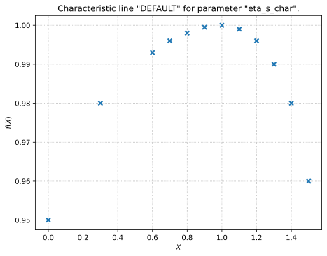

    Reference: Generic data.

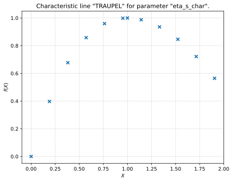

    Reference: :cite:`Traupel2001`.

**compressor**

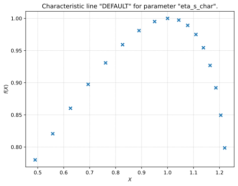

    Reference: Generic data.

**pump**

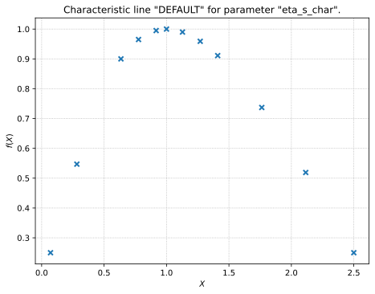

    Reference: Generic data.

**combustion engine**

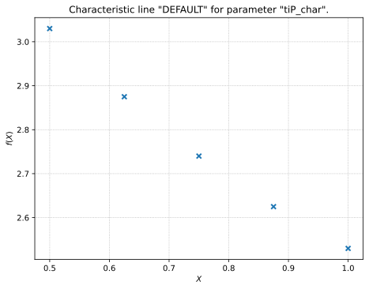

    Reference: Generic data.

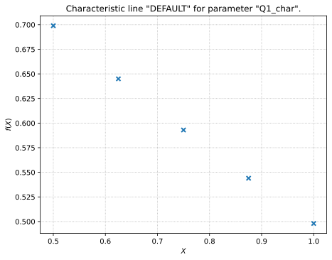

    Reference: Generic data.

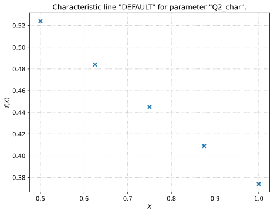

    Reference: Generic data.

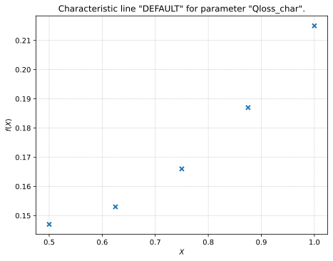

    Reference: Generic data.

**heat exchanger**

    Reference: Generic data.

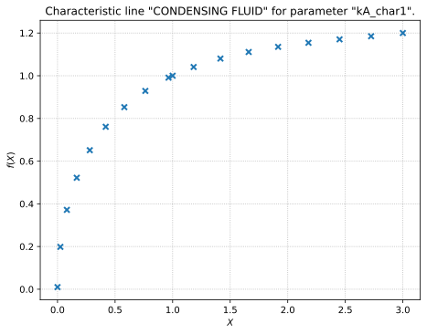

    Reference: Generic data.

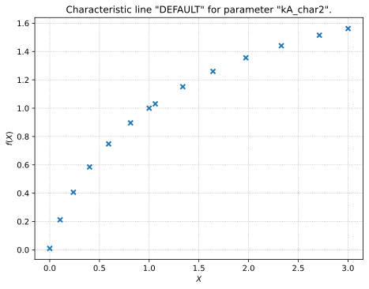

    Reference: Generic data.

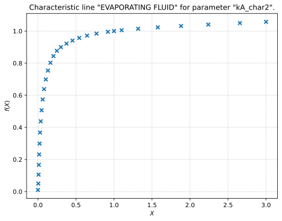

    Reference: Generic data.

**condenser**

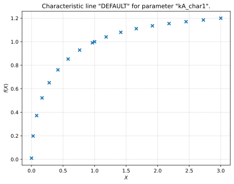

    Reference: Generic data.

    Reference: Generic data.

**desuperheater**

    Reference: Generic data.

    Reference: Generic data.

**heat exchanger simple**

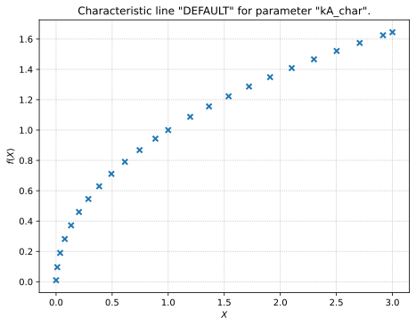

    Reference: Generic data.

**pipe**

    Reference: Generic data.

**water electrolyzer**

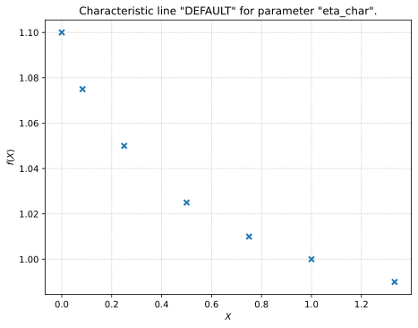

    Reference: Generic data.

Characteristic maps
^^^^^^^^^^^^^^^^^^^

**compressor**

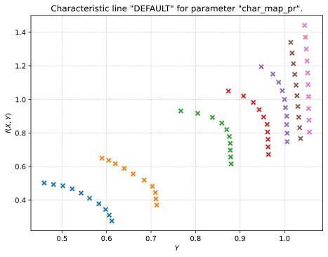

    Reference: :cite:`Plis2016`.

.. figure:: _images/compressor_char_map_eta_s_DEFAULT.svg
    :alt: Characteristic map "DEFAULT" for parameter "char_map_eta_s".
    :align: center

    Reference: :cite:`Plis2016`.

