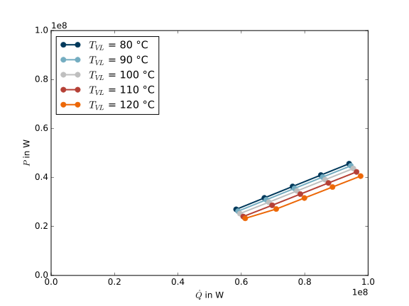

.. _tespy_label:

~~~~~~~~~~~~~~~~~~~~~~~~~~~~~~~~~~~~~~~~~~~~~~
TESPy -  Thermal Engineering Systems in Python
~~~~~~~~~~~~~~~~~~~~~~~~~~~~~~~~~~~~~~~~~~~~~~

TESPy is an oemof-package for the simulation of thermal process plants, such as thermal power plants or heat pumps. The package can be used to calculate stationary plant operation for design and offdesign cases. For example, in this way it is possible to derive plant characteristics which can be used in energy system simulations.

.. contents::
    :depth: 2
    :local:
    :backlinks: top

How can I use TESPy?
--------------------

To use TESPy you have to install TESPy. The installation provides some examples for testing purposes. Once the examples work you are close to your first power plant simulation.

Set up a plant
^^^^^^^^^^^^^^

In order to simulate a plant you will have to create a tespy.network. The network is the main container for the model.

You need to specify a list of the fluids you need for the calculation in your plant. The whole list of available fluids can be found in the docs. If you want to work with fluid mixtures, for now, it is only possible to use ideal mixtures of real gases. Mixtures of liquids and gases or two liquids are not available. For more information on the fluid properties see the CoolProp documentation on `Pure and Pseudo-Pure fluid properties <http://www.coolprop.org/fluid_properties/PurePseudoPure.html>`_. Further it is possible to choose a unit system for mass flow, temperature and pressure.

.. code-block:: python

    from tespy import nwk
	# create a network object with air and water as fluids
	# set the unitsystem for temperatures to °C and for pressure to bar
    my_plant = nwk.network(fluids=['air', 'water'], T='C', p='bar')

Now you can start to create the components of the network.

Set up the components
^^^^^^^^^^^^^^^^^^^^^

All components can be found in the components submodule. If you set up a component you have to specify a (within one network) unique label. Moreover, it is possible to specify parameters for the component, for example power P for a turbine or upper terminal temperature difference ttd_u of a heat exchanger. The full list of parameters for a specific component (e. g. a vessel) is stated in its class documentation.

Parameters for components are generally optional. Only the components label and in case you want to use a combustion chamber, the combustion chambers fuel, are mandatory parameters to provide. If an optional parameter is not specified by the user, it will be a result of the plants simulation. In this way, the set of equations a component returns is determined by which parameters you specify. You can find all equations in the components documentation as well. The example below shows how to create a component with specific parameters, set or reset and how to unset a parameter:

.. _pump-parametrisation:
.. code-block:: python

	from tespy import cmp
	my_pump = cmp.pump(label='hp pump', P=1e3) # create pump labeled 'hp pump' with a power of 1000 W
	my_pump.set_attr(P=2e3, eta_s=0.9) # reset power to 2000 W, set isentropic efficiency to 90 %
	my_pump.set_attr(P=math.nan) # unset power
	
After setting up the components the next step is to connect the components in our network.

Establish connections
^^^^^^^^^^^^^^^^^^^^^

Connections are used to link two components (outlet of component 1 to inlet of component 2, source to target). If two components are connected to each other the fluid properties at the source will be equal to the properties at the target. It is possible to set the properties on each connection in a similar way as parameters are set for components. You may specify:

 * mass flow*,
 * pressure*,
 * enthalpy*,
 * temperature*,
 * vapour mass fraction for pure fluids and
 * a fluid vector.

All parameters but the fluid vector have to be numeric values. The fluid vector has to be specified as dictonary, see the example below. For the properties marked with * it is possible to use references instead of numeric values. This can be used for example if you want to have the pressure in two parts of your network related in a specific way but you do not know the values prior to the plant simulation.

.. code-block:: python
	
	from tespy import con
	a = con.connection(waste_steam_source, 'out1', condenser, 'in1', x=0.97) # waste steam source to condenser hot side inlet and setting vapour mass fraction
	b = con.connection(condenser, 'out1', feed_water_pump, 'in1', fluid={'water': 1, 'air': 0}) # setting a fluid vector: {'fluid i': mass fraction i}
	c = con.connection(feed_water_tank, 'out1', feed_water_pump, 'in1') # connection without parameter specification
	d = con.connection(feed_water_pump, 'out1', economiser, 'in2', p=150) #  setting pressure
	e = con.connection(economiser, 'out2', drum, 'in1', T=320, p=con.ref(d, 0.98, 0)) # setting temperature and pressure via reference object
	f = con.connection(evaporator, 'out1', economiser, 'in1', T=350, m=100) # setting temperature and mass flow
	g = con.connection(economiser, 'out1', flue_gas_sink, 'in1', fluid={'water': 0, 'air': 1}, p=1.013) # setting fluid vector and pressure

If you want to set, reset or unset a connection parameter the same logic as for the components is applied.

.. code-block:: python

	a.set_attr(x=0.95, p=0.05) # reset vapour mass fraction, set pressure
	d.set_attr(p=math.nan) # unset pressure
	
Busses: power connections
^^^^^^^^^^^^^^^^^^^^^^^^^

Busses can be used to add up the power of different turbomachinery or to add up heat flux of different heat exchangers within your network. This can be used either for easy post processing, e. g. to calculate thermal efficiency or you can build up relations between components in your network. If you want to use the busses for postprocessing only, you do not specify the sum of the power or heat flux on your bus. For establishing relations between different components, for instance when using a steam turbine powered feed water pump, you have to set the total power on this bus. In the code example the power of the turbine and the feed water pump is added up and set to zero, as the turbines and feed water pumps power have to be equal in absolute value but have different sign. The sign can be manipulated, e. g. in order to design two turbines with equal power output.

.. code-block:: python
	
	from tespy import con
	a = con.bus('feed water pump', P=0)
	a.add_comps([turbine_fwp, 1], [fwp, 1])
	b = con.bus('turbines', P=0)
	b.add_comps([turbine_hp, 1], [turbine_lp, -1])
	
Two labels for busses have a predefined function in the postprocessing analysis: 'P' and 'Q_diss'. If you specify these labels for your busses, 'P' will be interpreted as the total power of your process and 'Q_diss' as total amount of dissipated heat flux (from the process, not internally). Given these key figures, thermal efficiency and COP will be calculated and an entropy analysis for your systems components will be performed.

Subsystems
^^^^^^^^^^

Subsystems are an easy way to add frequently used component groups such as a drum with evaporator or a preheater with desuperheater to your system. You can use the predefined subsystems or create a subsytem yourself from a network object. Every subsystem must have two interfaces, an inlet interface and an outlet interface. These interfaces have a variable number of connections, which can be connected with the rest of your network. The example below uses the predefined subsystem preheater with desuperheater (:code:`ph_desup()`). The subsystems interfaces are subsystem.inlet and subsystem.outlet, both with two connections. All connections (and components) of the subsystem have to be added to the network in order to start a simulation. This can easily be done by adding the whole subsystem object to your network.

.. note::
	for now, custom subsystems can not be loaded from a csv-file, as the network csv-loader is not ready yet.

.. code-block:: python

	from tespy import subsys, cmp
	source = cmp.source(label='source1')
	sink = cmp.sink(label='sink1')
	source2 = cmp.source(label='source2')
	sink2 = cmp.sink(label='sink2')

	# a preheater with desuperheater part
	subsystem = subsys.ph_desup(label='sub1', dT_G=8, dp1_desup=1, dp2_desup=1, dp1_cond=1, dp2_cond=1)

	# connections into the subsystem are attached to subsystem.inlet, connections out of the subsystem to subsystem.outlet
	a = connection(source, 'out1', subsystem.inlet, 'in1', m=5, p=4, h=29e5, fluid={'water': 1})
	b = connection(subsystem.outlet, 'out1', sink, 'in1')
	c = connection(source2, 'out1',subsystem.inlet,'in2', p=50, h=3e5, fluid={'water': 1})
	d = connection(subsystem.outlet, 'out2', sink2, 'in1', p0=50)

	# create the network and connections and subsystems
	nw = network(fluids=['water'], T='C')
	nw.add_conns(a, b, c, d)
	nw.add_subsys(subsys)
	

Simulate your plant
^^^^^^^^^^^^^^^^^^^

Before learning how to start the simulation a short introduction on how the solution process works is provdided below.

Introduction
++++++++++++

A tespy.network can be represented as a linear system of non-linear equations, consequently the solution is obtained with numerical methods. TESPy uses the n-dimensional newton algorithm to find the systems solution, which may only be found, if the network is parameterized correctly. The variables of the system are mass flow, pressure, enthalpy and the fluid components on each connection of the network. Thus, the number of fluids you specify in the fluid list for the network and the number of connections determine the number of variables in the system:

.. math:: num_{var} = num_{conn} \cdot (3 + num_{fluids}).

The newton algorithm requires the calculation of residual values for the equations and partial derivatives of all variables (jacobian matrix). In the next step the matrix has to be inverted and multiplied with the residual vector to calculate the increment for the systems variables. This process is repeated until every equations result in the system is correct, thus the residual values are smaller than a specified error tolerance.

jacobian matrix J

.. math::
	J(\vec{x})=\left(\begin{array}{cccc}
	\frac{\partial f_1}{\partial x_1} & \frac{\partial f_1}{\partial x_2} & \cdots & \frac{\partial f_1}{\partial x_n} \\ 
	\frac{\partial f_2}{\partial x_1} & \frac{\partial f_2}{\partial x_2} & \cdots & \frac{\partial f_2}{\partial x_n} \\ 
	\vdots & \vdots & \ddots & \vdots \\
	\frac{\partial f_n}{\partial x_1} & \frac{\partial f_n}{\partial x_2} & \cdots & \frac{\partial f_n}{\partial x_n}
	\end{array}\right)
	
calculate increment

.. math::
	\vec{x}_{i+1}=\vec{x}_i-J(\vec{x}_i)^{-1}\cdot f(\vec{x}_i)
	
stop when

.. math::
	||f(\vec{x}_i)|| \leq \epsilon

This means that you have to provide the exact amount of required parameters (neither less nor more) and the parametrisation must not lead to linear dependencies. Each parameter you set for a connection or each power respectively heat flux you set for a bus will add one equation. On top, each component provides a different amount of basic equations plus the equations provided by your component specification. For example, setting the power of the pump above results in an additional equation compared to a pump without specified power:

.. math::
	\forall i \in \mathrm{network.fluids} \, &0 = fluid_{i,in} - fluid_{i,out}\\
											 &0 = \dot{m}_{in} - \dot{m}_{out}\\
					 \mathrm{additional:} \, &0 = 1000 - \dot{m}_{in} (\cdot {h_{out} - h_{in}})

Initialise the calculation
++++++++++++++++++++++++++

The newton algorithm requires starting values for all variables of the system. A high quality of initial values (low deveiation from solution) improves convergence speed and stability, whereas bad starting values might lead to instabilty and diverging calculation can be the result. In order to provide good initial values you can choose between three different initialisation options:

* initialise with standard values,
* provide starting values on your connections (see connection d in the subsystem example, usage: :code:`m0, p0, h0`) and
* provide a .csv-file of a previously calculated network.

The last option usually yields the best performance and is highly receommended. In order to initialise your calculation from a *.csv-file, you need to provide the filename *. The file does not need to contain all connections of your network, thus you can build up your network bit by bit and initialise the untouched part of your network from the .csv-file.

Solve the network
+++++++++++++++++

Starting with the subsystem example, in order to start your calculation you need to add the following line to your code:

.. code-block:: python

	solve.loop(nw, init_file=None, design_file=None, mode='design')
	
This starts the initialisation of your network and proceeds to its calculation.

* :code:`nw` is the network object,
* :code:`init_file` is the .csv-file you want to use for initialisation,
* :code:`design_file` is the .csv-file which holds the information of your plants design point and
* :code:`mode` is the calculation mode (design-calculation or offdesign-calculation).

There are two modes available (:code:`'design'` and :code:`'offdesign'`). If you choose :code:`offdesign` as calculation mode a design file must be specified. The initialisation file is always optional, if you specify it to be :code:`None`, the initialisation from .csv-file will be skipped.

Postprocessing
++++++++++++++

The preprocessing has three functions you can apply to your calculation:

* plot the convergence history,
* print the results to prompt and
* save the results in a .csv-file.

The plotting function is designed to use for trouble shooting when your calculation does not converge. Therefore you can specify a maximum number of iterations for the newton algorithm before calculation will be canceled. As a result you get a plot of mass flow, pressure and enthalpy on all connections of your network. From there it might be possible to identify e. g. oscillating values, which might be stabilised with improved initialisation parameters.

Offdesign calculations
++++++++++++++++++++++
	
After designing your process you might want to gain information on offdesign behaviour. By stating :code:`'offdesing'` as calculation mode, you can switch the component behaviour to offdesign. For example, this means that pressure drop in a pipe will be the result of reynolds number and the pipes dimensions. The table below shows all offdesign parameters available.

=======================	======================	===================================================
 component             	 parameter            	 affects
=======================	======================	===================================================
 vessel                	 zeta                  	 pressure drop
-----------------------	----------------------	---------------------------------------------------
 pipe                  	 | zeta                	 | pressure drop
                       	 | dimensions          	 | pressure drop
                       	 | kA, amb temperature 	 | heat flux
-----------------------	----------------------	---------------------------------------------------
 simple heat exchanger 	 see pipe              	  
-----------------------	----------------------	---------------------------------------------------
 heat exchanger        	 | zeta1              	 | pressure drop hot side
                       	 | zeta2              	 | pressure drop cold side
                       	 | kA                 	 | heat flux
-----------------------	----------------------	---------------------------------------------------
 pump                  	 characteristic       	 isentropic efficiency
-----------------------	----------------------	---------------------------------------------------
 turbine               	 | cone law           	 | pressure drop, volumetric flow
                       	 | characteristic     	 | isentropic efficiency
-----------------------	----------------------	---------------------------------------------------
 compressor            	 | characteristic     	 | mass flow, pressure rise, isentropic efficiency
                       	 | vigv angle :sup:`1` 	 | see above, one arbitrary parameter less
=======================	======================	===================================================

1: When setting the vigv angle the characteristic map will be used for a specific vigv angle. The vigv angle is a result of the calculation, if you use the characteristic map only

.. _example:
How can TESPy contribute to your energy system calculations?
------------------------------------------------------------

In this part you learn how you can use TESPy for your energy system calculations: Basically TESPy performs component based simulation of thermal power plants and e. g. heating networks. In energy system calculations, for instance in oemof-solph, plants are usually modelled as abstract components on a much lower level of detail. In order to represent a plant within an abstract component it is possible to supply characteristics establishing a connection between your energy system model and a specific plant model. Thus the characteristics are a representation of a specific plant layout in terms of topology and process parameters.

The following part will show how to generate characteristics for a CHP unit. There are various technologies and concepts, for this example we will generate characteristics for a simple CHP with a backpressure steam turbine and a regenerative reheating unit as shown in the figure below. We want the characteristics to provide a correlation between output power and output heat flux at different temperatures of flow into a district heating system.

.. _topology:

	
    Topology of the power plant.

Important design information can be obtained from the table below, the locations are indicated in the figure. After designing the plant, the mass flow in the main steam cycle has been changed stepwise from a slight overload of 50 kg/s to lower part loads (30 kg/s) with a stepwidth of 5 kg/s. Further the required temperature for the heating system was changed from 80 °C to 120 °C in steps of 10 K.

=========== =============== ======= ========
 location    parameter       value   unit
=========== =============== ======= ========
 fs          | pressure      | 100   | bar
             | temperature   | 550   | °C
             | mass flow     | 47    | kg/s
----------- --------------- ------- --------
 extr        pressure        10      bar
----------- --------------- ------- --------
 condenser   ttd_u :sup:`2`  7       K
----------- --------------- ------- --------
 reheater    ttd_u :sup:`2`  7       K
----------- --------------- ------- --------
 from_hs     | pressure      | 10    | bar
             | temperature   | 60    | °C
----------- --------------- ------- --------
 to_hs       temperature     110     °C
=========== =============== ======= ========

2: ttd_u is the upper terminal temperature difference, defined as temperature difference between hot side inlet and cold side outlet.

As a result we get the PQ-diagram of this power plant containing the characteristics at different temperatures in the heating system. Within your oemof-solph energy system it is now possible to implement the characteristic lines as a function of the temperature level in the heating system.

.. _diagram:

	
    PQ-diagram for a CHP unit.
	
Download the :download:`source file <../../examples/CHP.py>` of this example.